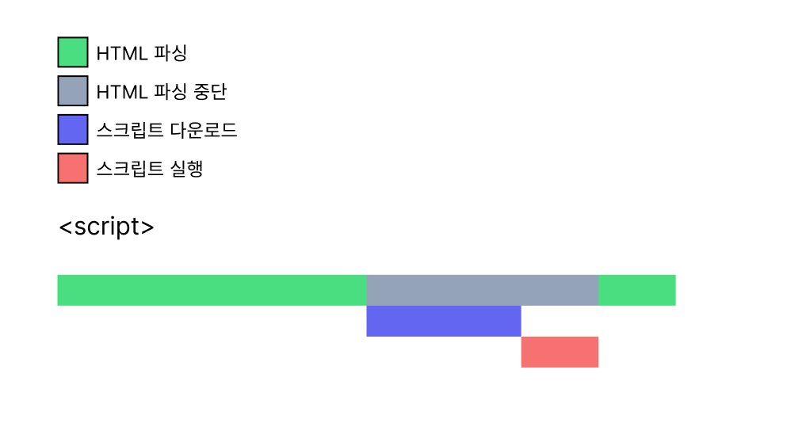
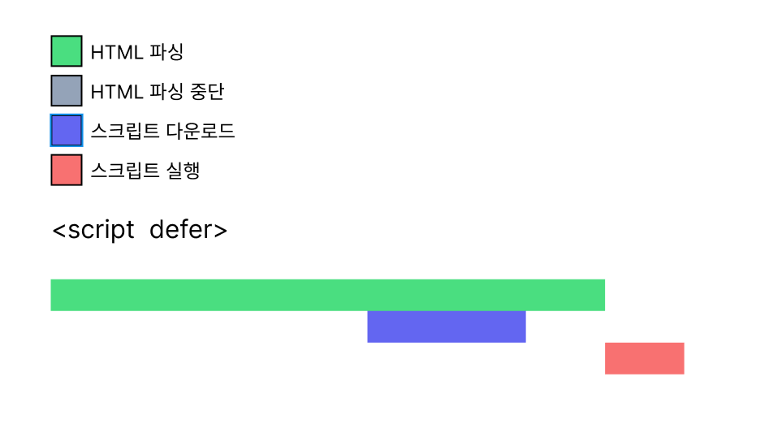
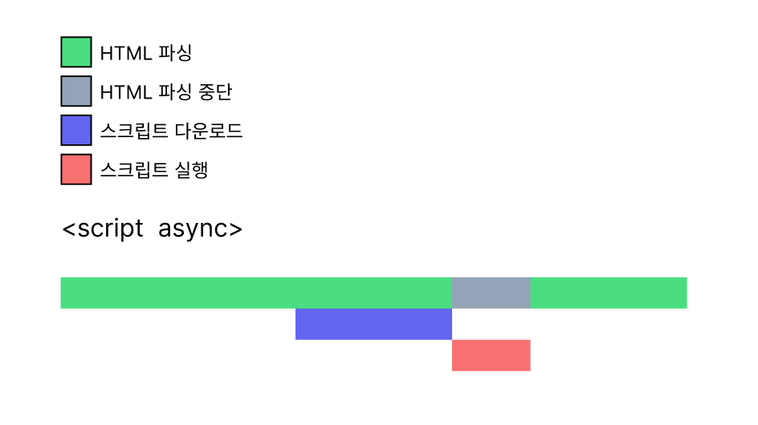

# Async & Defer

### C조 워커

---

### 목차

1. 스크립트 로딩 전략
2. 예시
3. 정리

---

## 스크립트 로딩전략

```HTML
<!-- 1 -->
<head>
  <script src="./script.js"></script>
</head>
<body>
  <h1>A</h1>
  <h1>B</h1>
</body>
```

```HTML
<!-- 2 -->
<head>
  <script>
    console.log(document.getElementsByTagName("h1"))
  </script>
</head>
<body>
  <h1>A</h1>
  <h1>B</h1>
</body>
```

```HTML
<!-- 3 -->
<body>
  <h1>A</h1>
  <script src="./script.js"></script>
  <h1>B</h1>
</body>
```

```HTML
<!-- 4 -->
<body>
  <h1>A</h1>
  <h1>B</h1>
  <script src="./script.js"></script>
</body>
```

---

## \<script>



---

## \<script defer>



---

## \<script async>



---

## defer vs async 정리

|      | defer                                                                     | async                                                   |
| ---- | ------------------------------------------------------------------------- | ------------------------------------------------------- |
| 정의 | defer는 HTML 문서가 파싱되기 전까지 평가되지 않음                         | async로 로드된 스크립트는 다운로드가 완료되면 즉시 평가 |
| 특징 | 순서대로 처리되므로 실행 순서가 예측 가능                                 | 실행 순서가 보장되지 않음                               |
| 활용 | 서로 의존성이 있는 여러 개의 스크립트 파일을 순차적으로 실행해야하는 경우 | 여러 개의 독립된 자바스크립트 파일을 삽입하는 경우      |
